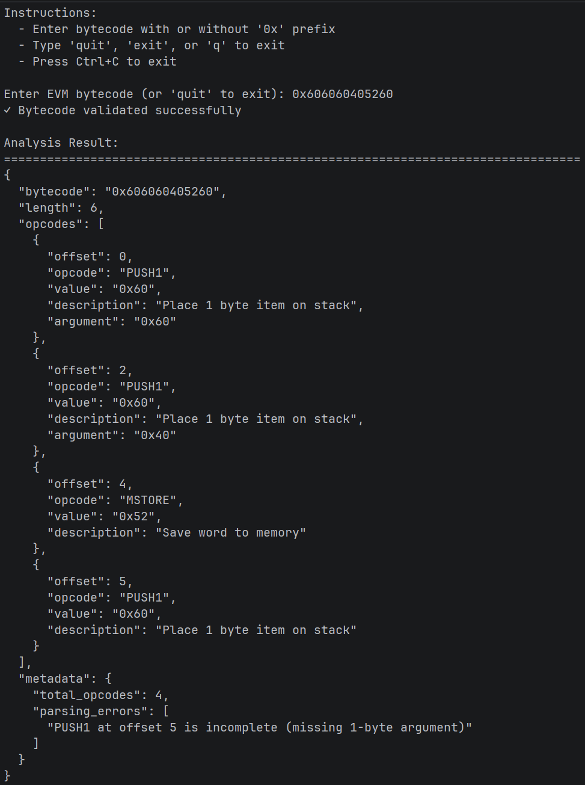

# EVM Bytecode Analyzer
A command-line tool that parses Ethereum bytecode into structured opcode sequences. Takes raw hexadecimal bytecode and outputs readable JSON with opcode names, arguments, and metadata.

## What it does
The tool analyzes EVM bytecode at the lowest level. It validates the input format, identifies each opcode byte, extracts arguments from PUSH operations (PUSH1 through PUSH32), and detects invalid bytes that don't correspond to valid opcodes.
Input and output modes are flexible. Interactive mode prompts for bytecode entry. CLI mode accepts bytecode strings directly or reads from binary files. Results export to JSON, either displayed in the terminal or saved to a file.
The parser handles all EVM opcodes from the Shanghai/Cancun specification. It processes simple opcodes (arithmetic, stack operations, memory) and complex ones with variable-length arguments. Error detection identifies incomplete PUSH operations and reports them in the metadata.

## How it works
The architecture splits into five modules: opcodes mapping, validation, parsing, formatting, and CLI. Each module handles one responsibility.
The opcodes module maps byte values to opcode information—names, descriptions, and argument sizes. The validator runs five checks: type verification, non-empty content, mandatory 0x prefix, hexadecimal characters only, and even byte length.
The parser implements a dispatcher pattern. It reads bytecode byte by byte, checks if each byte is a valid opcode, and routes special opcodes (PUSH operations) to dedicated handlers. PUSH opcodes consume multiple bytes—the opcode itself plus 1 to 32 argument bytes. The parser calculates how many bytes each opcode consumes and advances the pointer accordingly.
For PUSH operations, a single function handles all 33 variants (PUSH1 through PUSH32). It calculates argument size dynamically: push_size = opcode_byte - 0x5F. This generic approach eliminates code duplication and simplifies maintenance.
The formatter converts parsed data to JSON with configurable indentation. The CLI orchestrates the pipeline: clean input, validate format, parse opcodes, format output, display or save results.

## Learning zkEVM with bytecode analysis
zkEVM implementations (zkSync, Polygon zkEVM, Scroll) prove EVM execution in zero-knowledge circuits. Understanding bytecode is essential for understanding what these systems prove.
Each opcode becomes a circuit constraint. PUSH operations are simple—they just load constants. But operations like SLOAD or CALL require complex circuit logic for Merkle proofs, storage access, and state transitions. Analyzing bytecode reveals which operations dominate a contract's execution profile.
zkEVM systems must handle every opcode correctly. Parsing real contract bytecode exposes edge cases: incomplete PUSH operations, invalid bytes, unusual opcode sequences. These edge cases must all be provable in circuits.
Some opcodes are more expensive in zkEVM than in regular EVM. Keccak, for instance, requires thousands of circuit constraints. By analyzing contract bytecode, you can estimate the proving cost—count how many Keccak operations appear and multiply by the per-operation constraint count.
Bytecode analysis also helps understand compiler output differences. zkEVM compilers (zksolc, zkvyper) sometimes generate different bytecode than standard Solidity. Comparing the two reveals optimization strategies specific to zero-knowledge proving.

## Conclusion
The tool provides raw bytecode visibility without abstraction layers. Available as open source under GPL v3.0 at github.com/Artyflex/ethereum-bytecode-analyzer.